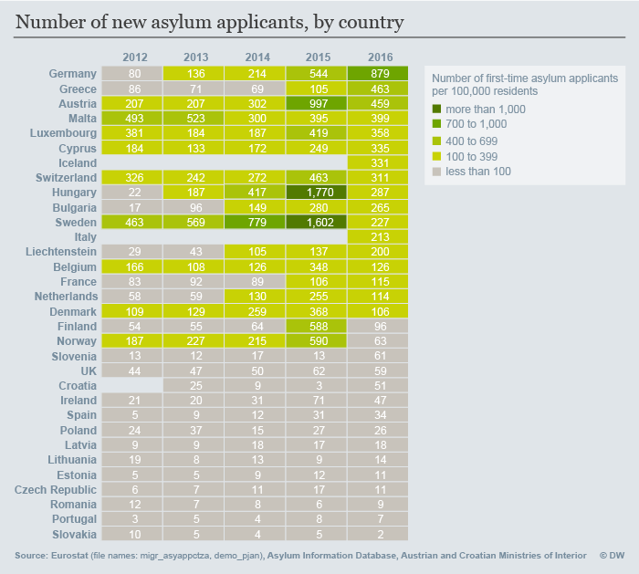
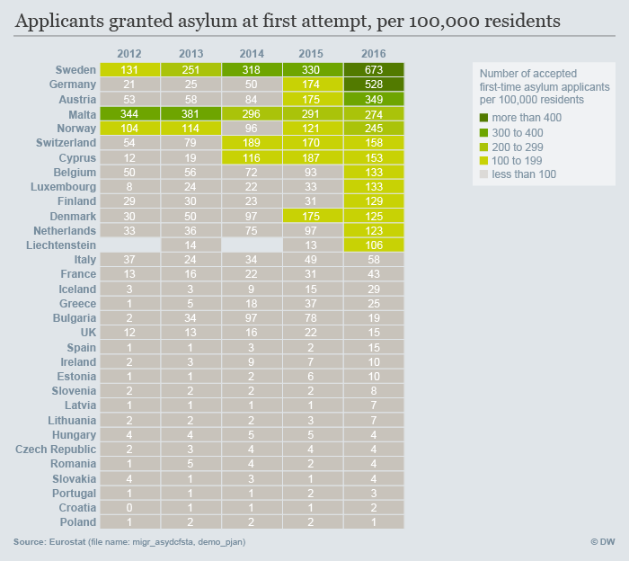
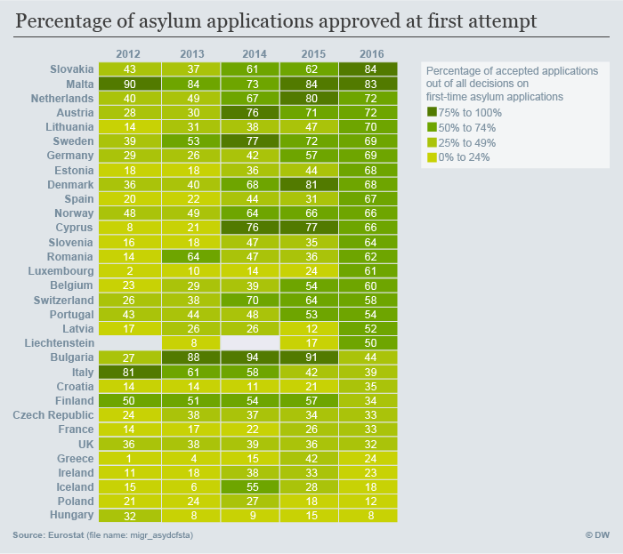
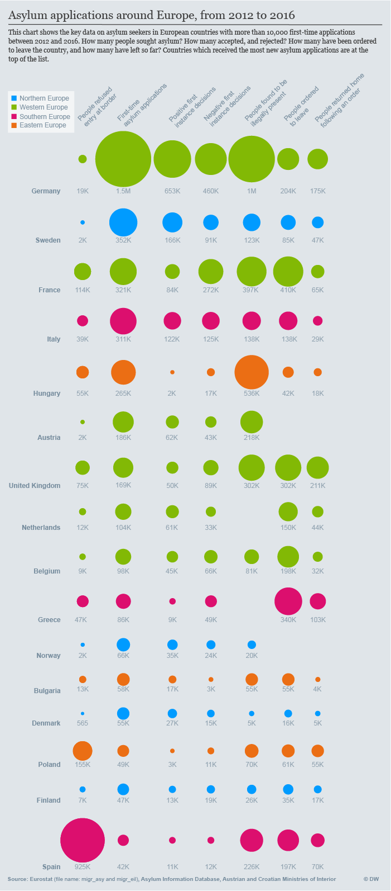

# What's the extent of the refugee crisis in Europe?

### Data sources
Eurostat [migr_asyappctza](http://appsso.eurostat.ec.europa.eu/nui/show.do?dataset=migr_asyappctza&lang=en)
Eurostat [migr_asydcfstq](http://appsso.eurostat.ec.europa.eu/nui/show.do?dataset=migr_asydcfstq&lang=en)
Eurostat [migr_asydcfsta](http://appsso.eurostat.ec.europa.eu/nui/show.do?dataset=migr_asydcfsta&lang=en)
Eurostat [migr_eiord](http://appsso.eurostat.ec.europa.eu/nui/show.do?dataset=migr_eiord&lang=en)
Eurostat [migr_eipre](http://appsso.eurostat.ec.europa.eu/nui/show.do?dataset=migr_eipre&lang=en)
Eurostat [migr_eirfs](http://appsso.eurostat.ec.europa.eu/nui/show.do?dataset=migr_eirfs&lang=en)
Eurostat [migr_eirtn](http://appsso.eurostat.ec.europa.eu/nui/show.do?dataset=migr_eirtn&lang=en)
Eurostat [demo_pjan](http://appsso.eurostat.ec.europa.eu/nui/show.do?dataset=demo_pjan&lang=en)

Missing data first-time asylum applicants via Minos Mouzourakis, AIDA Coordinator

[Croatian Ministry of Interior via AIDA](https://www.mup.hr/UserDocsImages/Dokumenti/stranci/2015/azil_2008_2014.pdf)

Croatia 2012: 1195

[AIDA - Country Profile Austria](http://www.asylumineurope.org/reports/country/austria)
[Austrian Ministry of Interior via Aida](http://www.bmi.gv.at/cms/BMI_Asylwesen/statistik/start.aspx)

Austria 2012: 17413

Austria 2013: 17503

Austria 2014: 28064

[AIDA - Country Profile Hungary - First report 2013](http://www.asylumineurope.org/reports/country/hungary)

Hungary 2012: 2157

### Definitions
- only looking at first-time asylum applications and first-instance decisions
- selecting the period of 2012 to 2016, as the first Syrian refugees arrived in Greece in 2012 (Turkey: 2011)

### Output
**Heatmaps**
* Crisis started way earlier for southern countries than for northern ones
* Hungary received high numbers of applications - underreported?
* Bulgaria had long high shares of positive decisions and which then suddenly halved

**D3.js Bubble Chart**
* France has more negative (76%) than positive decisions
* UK has the same pattern (64% of all decisions are negative)
* Bulgaria only decided on 34% of applications that were open during 2012-2016
* Hungary has the highest number of illegally present, but doesn't seem to order them to leave
* High discrepancy between ordered to leave and left upon order in France and Belgium -- for each country, only 16% of people actually return

